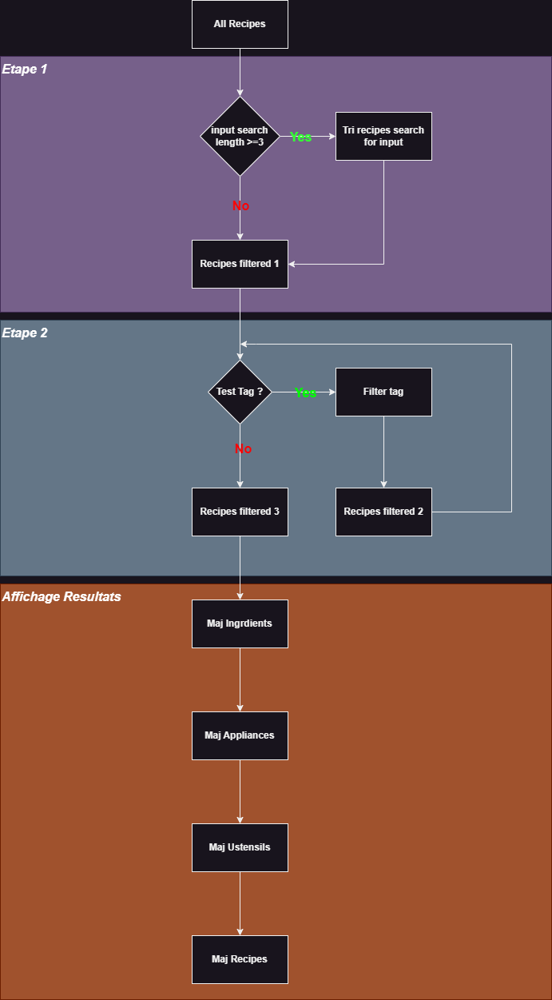
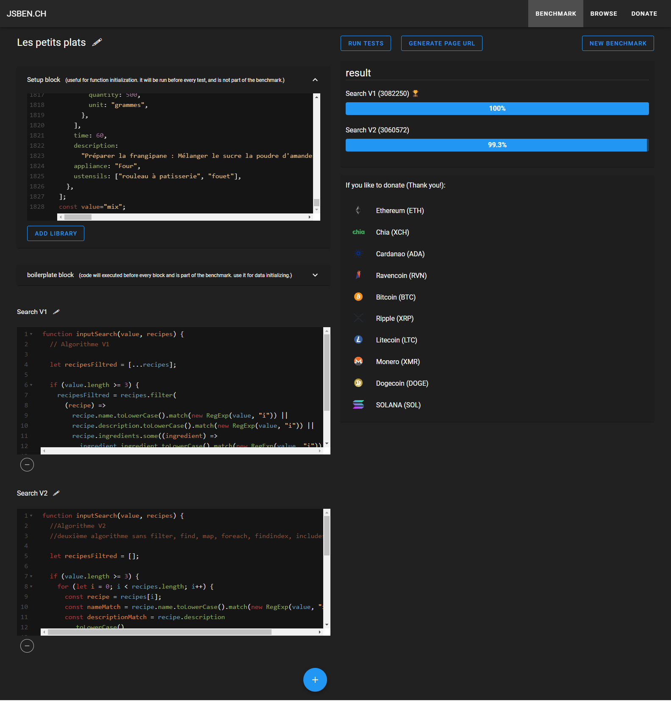

Projet OpenClassRoom

<!-- PROJECT LOGO -->
 

  <h1>Les petits plats</h1>
  

<!-- TABLE OF CONTENTS -->

  
Table of Contents

  <ol>
    <li> <a href="#about-the-project">About The Project</a></li>
    <li><a href="#built-with">Built With</a></li>
    <li><a href="#testez-le-projet">Testez le projet</a></li>
    <li><a href="#license">License</a></li>
    <li><a href="#contact">Contact</a></li>
  </ol>

<!-- ABOUT THE PROJECT -->

## About The Project

[![Contributors][contributors-shield]][contributors-url]
[![Forks][forks-shield]][forks-url]
[![Issues][issues-shield]][issues-url]

Développez un algorithme de recherche en JavaScript

Après avoir édité des livres de cuisine pendant plusieurs années, l’entreprise à décidé de lancer son propre site de recettes de cuisine à l’instar de Marmiton ou 750g.

Vous etes chargé de fournir tout le HTML, le CSS et le JavaScript nécessaires au fonctionnement et à la fluidité du moteur de recherche.

- Pour tout algorithme important qu’on développe, on a pour habitude d’en faire deux implémentations différentes pour pouvoir comparer leurs performances et choisir la meilleure.
  Utilise 2 branches différentes sur Git afin qu’on conserve bien le code séparé pour chacun

- Respecte les bonnes pratiques de Green Code : découpe ton code au maximum en fonctions réutilisables, par exemple pour les cartes des recettes ou encore la génération des listes de tags ;

- Fais attention au risque d’injection de balises html ou toute autre faille de sécurité dans le site via les formulaires.

Pour choisir le meilleur algorithme, il faut tester leurs performances. Pour ça, utilise un outil de comparaison de performance tel que <a href="https://jsben.ch/"> Jsben.ch</a> par exemple.

<a href="https://course.oc-static.com/projects/516_JS/P7/Cas+d%E2%80%99utilisation+%2303+_+Filtrer+les+recettes+dans+l%E2%80%99interface+utilisateur+-+Front-end+P6+(Algorithms)+.pdf">Fiche d’investigation fonctionnalité</a>

<a href="https://s3-eu-west-1.amazonaws.com/course.oc-static.com/projects/Front-End+V2/P6+Algorithms/Fiche+d%E2%80%99investigation+fonctionnalite%CC%81.pdf">Cas d'utilisation</a>

<a href="https://www.figma.com/file/LY5VQTAqnrAf0bWObOBrt8/Les-petits-plats---Maquette-2.0?type=design&node-id=0-1&mode=design&t=vlie6mckh4mQe7h9-0"> Maquette Figma</a>

## Built with

(<a href="#readme-top">back to top</a>)

<!-- Fonctionnement -->

## Fonctionnement

Algorigramme

<!-- Liens Projet -->

## Testez le projet

Rien à installer ici, il suffit d'ouvrir le fichier `index.html`.

Github: [https://erik-42.github.io/openclassroom-projet_7-les_petits_plats/](https://erik-42.github.io/openclassroom-projet_7-les_petits_plats/)

<!-- Benchmark -->

## Benchmark

[Fiche d'investigation de fonctionnalité](<benchmark/Fiche d'investigation de fonctionnalité.xlsx>)

Test algorithme: https://jsben.ch/

<!-- LICENSE -->

## License

Distributed under the MIT License. See `LICENSE.txt` for more information.

Formation OpenClassRoom Développeur d'application - JavaScript React

(<a href="#readme-top">back to top</a>)

<!-- CONTACT -->

## Contact

[![GitHub followers][github followers-shield]][github followers-url]
[![Stargazers][stars-shield]][stars-url]
[![GitHub repo][github repo-shield]][github repo-url]

[![Github Badge][github badge-shield]][github badge-url]
[![LinkedIn][linkedin-shield]][linkedin-url]

https://basillecorp.dev

mesen.erik@gmail.com

(<a href="#readme-top">back to top</a>)

<!-- MARKDOWN LINKS & IMAGES -->
<!-- https://www.markdownguide.org/basic-syntax/#reference-style-links -->

[product-screenshot]: ./images/screenshot.png
[wakatime-shield]: https://wakatime.com/badge/user/f84d00d8-fee3-4ca3-803d-3daa3c7053a5.svg
[wakatime-url]: https://wakatime.com/@f84d00d8-fee3-4ca3-803d-3daa3c7053a5
[github badge-shield]: https://img.shields.io/badge/Github-Erik--42-155?style=for-the-badge&logo=github
[github badge-url]: https://github.com/Erik-42
[github repo-shield]: https://img.shields.io/badge/Repositories-36-blue
[github repo-url]: https://github.com/Erik-42?tab=repositories
[github repo file count (file type)-shield]: https://img.shields.io/github/directory-file-count/Erik-42/openclassroom-projet_7-les_petits_plats
[github repo file count (file type)-url]: https://github.com/directory-file-count/Erik-42/openclassroom-projet_7-les_petits_plats
[github followers-shield]: https://img.shields.io/github/followers/Erik-42
[github followers-url]: https://github.com/followers/Erik-42
[github all releases-shield]: https://github.com/Erik-42/openclassroom-projet_7-les_petits_plats/total
[github all releases-url]: https://github.com/Erik-42/openclassroom-projet_7-les_petits_plats/releases
[github repo size-shield]: https://img.shields.io/github/repo-size/Erik-42/openclassroom-projet_7-les_petits_plats
[github repo size-url]: https://github.com/Erik-42/openclassroom-projet_7-les_petits_plats
[contributors-shield]: https://img.shields.io/github/contributors/Erik-42/openclassroom-projet_7-les_petits_plats
[contributors-url]: https://github.com/Erik-42/openclassroom-projet_7-les_petits_plats/graphs/contributors
[forks-shield]: https://img.shields.io/github/forks/Erik-42/openclassroom-projet_7-les_petits_plats
[forks-url]: https://github.com/Erik-42/openclassroom-projet_7-les_petits_plats/forks
[stars-shield]: https://img.shields.io/github/stars/Erik-42
[stars-url]: https://github.com/Erik-42?tab=stars
[issues-shield]: https://img.shields.io/github/issues-raw/Erik-42/openclassroom-projet_7-les_petits_plats
[issues-url]: https://github.com/Erik-42/openclassroom-projet_7-les_petits_plats/issues
[license-shield]: https://img.shields.io/github/license/Erik-42/openclassroom-projet_7-les_petits_plats
[license-url]: https://github.com/Erik-42/openclassroom-projet_7-les_petits_plats/blob/master/LICENSE.txt
[linkedin-shield]: https://img.shields.io/badge/-LinkedIn-black.svg?style=for-the-badge&logo=linkedin&colorB=555
[linkedin-url]: https://www.linkedin.com/in/erik-mesen/
[html-shield]: https://img.shields.io/badge/-LinkedIn-black.svg?style=for-the-badge&logo=linkedin&colorB=555
[html-url]: https://html.spec.whatwg.org/
[css-shield]: https://img.shields.io/badge/-LinkedIn-black.svg?style=for-the-badge&logo=linkedin&colorB=555
[css-url]: https://www.w3.org/TR/CSS/#css
[javascript-shield]: https://img.shields.io/badge/-LinkedIn-black.svg?style=for-the-badge&logo=linkedin&colorB=555
[javascript-url]: https://www.ecma-international.org/publications-and-standards/standards/ecma-262/
